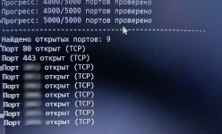
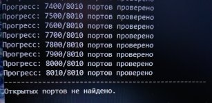

# 📡 Zero Firewall
Это конфиг для **NFTables**, который является расширенной заменой базового функционала ufw с дополнительными правилами защиты.

Он рассчитан на защиту серверов от распространённых проблем: сканирование портов, большое количество мусорного трафика, простые TCP/UDP flood-атаки, некорректные TCP пакеты и подозрительная сетевая активность.

Конфиг создавался в первую очередь для VDS/Дедиков с игровыми серверами (например Minecraft) и веб-сервисами.

#### 💤 Без защиты:



#### 🚨 С защитой:


> [!WARNING]
> Не используйте его вместе с ufw. Перед установкой необходимо либо удалить ufw, либо отключить его:
> ```
> sudo systemctl disable --now ufw
> ```
> nftables не является заменой защиты на уровне провайдера. Если по вашему IP идёт большой DDoS выше возможностей вашего канала, этот конфиг не спасёт.
> Данный конфиг предназначен для фильтрации и автоматической блокировки части вредоносного трафика уже на стороне сервера, но он не защищает от реального DDoS

---

## ⚜️ Возможности:


1. Автоматическая блокировка IP при подозрительной активности.
2. Защита от простых TCP SYN flood и UDP flood атак с временными автобанами.
3. Защита от сканирования TCP/UDP портов.
4. Раздельная работа с IPv4 и IPv6.
5. Белый список IP-адресов (whitelist4 и whitelist6) с полным обходом правил.
6. ACL для отдельных портов (port_acl4 и port_acl6) - возможность разрешить определённый порт только конкретному IP.
7. Поддержка Docker и WireGuard. Интерфейсы docker0 и wg0 учтены в правилах (можете заменить на свои).
8. Фильтрация некорректных TCP пакетов и части подозрительного сетевого мусора.
9. Ограничение количества новых TCP сессий с одного адреса (по умолчанию 64).
10. Поддержка ICMP/ICMPv6.

Конфиг тестировался на Ubuntu 24.04.4 TLS с nftables v1.0.9, но должен работать на системах с современным nftables.


---

## 🗃️ Установка:


Проверьте наличие nftables:
```
sudo nft -v
```
Если nftables отсутствует:
```
sudo apt update
sudo apt install nftables
```
Перед установкой переименуйте текущий конфиг:
```
sudo mv /etc/nftables.conf /etc/nftables.conf.bak
```
После этого поместите новый nftables.conf в папку /etc.

Перед запуском обязательно проверьте конфиг:
```
sudo nft -c -f /etc/nftables.conf
```
Если ошибок нет:
```
sudo systemctl enable --now nftables
```
Или если nftables уже был установлен:
```
sudo systemctl restart nftables
```

Если при проверке появились ошибки, восстановите переименованный nftables.conf.bak и перезапустите nftables.


---

## 🧩 Настройка:


По умолчанию разрешены следующие TCP порты IPv4:

```
set allowed_tcp4 {
    type inet_service
    flags interval
    elements = { 80, 443, 3306, 25565, 22 }
}
```

UDP порты по умолчанию закрыты:

```
set allowed_udp4 {
    type inet_service
    flags interval
}
```

Добавьте необходимые порты вручную.

> [!WARNING]
> Обязательно добавьте ваш SSH порт, иначе после применения правил можно потерять доступ к серверу.

Для добавления своего IP в белый список:

```
set whitelist4 {
    type ipv4_addr
    flags interval
    elements = { ВАШ.IP }
}
```


Остальные настройки описаны комментариями внутри самого конфига.


---

## 🔭 Команды:


### > IPv4:


Посмотреть IPv4, заблокированные за вредоносный трафик:
```
sudo nft list set inet filter ddos4
```
Посмотреть IPv4, заблокированные за сканирование портов:
```
sudo nft list set inet filter portscanners4
```
Сбросить все IPv4 автобаны:
```
sudo nft flush set inet filter ddos4 && sudo nft flush set inet filter portscanners4
```

### > IPv6:


Посмотреть IPv6, заблокированные за вредоносный трафик:
```
sudo nft list set inet filter ddos6
```
Посмотреть IPv6, заблокированные за сканирование портов:
```
sudo nft list set inet filter portscanners6
```
Сбросить все IPv6 автобаны:
```
sudo nft flush set inet filter ddos6 && sudo nft flush set inet filter portscanners6
```

---

## 📚 Дополнительно:


Bogon сети по умолчанию разрешены только в интерфейсе wg0:

```
ip saddr @bogon4 iifname != "wg0" drop
ip6 saddr @bogon6 iifname != "wg0" drop
```

Вот список Bogon сетей:

```
# IPv4 bogon
    set bogon4 {
        type ipv4_addr
        flags interval
        elements = { 0.0.0.0/8, 10.0.0.0/8, 100.64.0.0/10, 127.0.0.0/8, 169.254.0.0/16, 172.16.0.0/12, 192.0.0.0/24, 192.0.2.0/24, 192.168.0.0/16, 198.18.0.0/15, 198.51.100.0/24, 203.0.113.0/24, 224.0.0.0/4, 240.0.0.0/4 }
 
# IPv6 bogon
    set bogon6 {
        type ipv6_addr
        flags interval
        elements = { ::/128, ::1/128, ::ffff:0:0/96, 100::/64, 2001:10::/28, 2001:db8::/32, 3fff::/20, fc00::/7, fec0::/10, ff00::/8 }[/CODE]
```

Если вам необходимо использовать такие адреса на других интерфейсах - измените данные правила.

> [!NOTE]
> Не изменяйте конфиг без понимания синтаксиса nftables.
> Конфиг не ограничивает исходящий трафик от сервера.
> Возможны ложные срабатывания. Если найдёте проблемы или несовместимость  - сообщайте.
