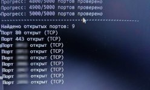
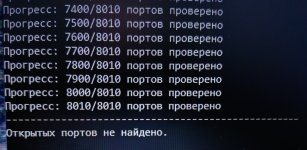

# 📡 Zero Firewall

Конфиг для **nftables**, расширяющий базовую фильтрацию трафика дополнительными правилами защиты.

Он предназначен для защиты серверов от распространённых проблем: сканирования портов, большого количества мусорного трафика, простых TCP/UDP flood атак и некорректных TCP пакетов.

Конфиг создавался в первую очередь для VDS/дедикированных серверов с игровыми серверами (например, Minecraft) и веб-сервисами.

<details>
<summary>Защита от сканеров портов</summary>

#### 💤 Без защиты



#### 🚨 С защитой



</details>

> [!WARNING]
> Не используйте этот конфиг вместе с `ufw`. Перед установкой удалите `ufw` или отключите его:
>
> ```bash
> sudo systemctl disable --now ufw
> ```
>
> `nftables` не заменяет защиту на уровне сетевого провайдера. Если на ваш IP направлен DDoS, превышающий пропускную способность вашего канала или возможности сервера, этот конфиг не сможет его остановить.
>
> Zero Firewall предназначен для фильтрации и автоматической блокировки части вредоносного трафика уже на стороне сервера, но не является полноценной защитой от DDoS.

## ⚜️ Возможности

1. Автоматическая блокировка IP при подозрительной активности.
2. Защита от простых TCP SYN flood и UDP flood атак с временными автобанами.
3. Защита от сканирования TCP/UDP портов.
4. Раздельная работа с IPv4 и IPv6.
5. Списки доверенных IP адресов (`bypass4` и `bypass6`) с полным обходом правил.
6. ACL для отдельных портов (`port_acl4` и `port_acl6`) – возможность разрешить определённый порт только конкретному IP.
7. Поддержка Docker и WireGuard. Интерфейсы `docker0`, `br-*` и `wg0` учитываются в правилах и могут быть изменены под вашу конфигурацию.
8. Фильтрация некорректных TCP пакетов и части подозрительного сетевого трафика.
9. Ограничение количества новых TCP сессий с одного адреса: до 100 для IPv4 и до 64 для IPv6.
10. Поддержка ICMP/ICMPv6.

Конфиг тестировался на **Ubuntu 26.04.1** с **nftables v1.1.6**. Использование на других системах требует совместимой версии nftables и ядра Linux.

## 🗃️ Установка

Проверьте наличие `nftables`:

```bash
sudo nft -v
```

Если `nftables` отсутствует:

```bash
sudo apt update
sudo apt install nftables
```

Перед установкой сохраните текущий конфиг:

```bash
sudo mv /etc/nftables.conf /etc/nftables.conf.bak
```

После этого поместите новый `nftables.conf` в `/etc`.

Перед запуском обязательно проверьте конфиг:

```bash
sudo nft -c -f /etc/nftables.conf
```

Если ошибок нет, запустите `nftables`:

```bash
sudo systemctl enable --now nftables
```

Если `nftables` уже запущен:

```bash
sudo systemctl restart nftables
```

Если при проверке или запуске появились ошибки, восстановите предыдущий конфиг:

```bash
sudo mv /etc/nftables.conf.bak /etc/nftables.conf
sudo systemctl restart nftables
```

## 🧩 Настройка

По умолчанию разрешены следующие TCP порты IPv4:

```nft
set allowed_tcp4 {
    type inet_service
    flags interval
    elements = { 80, 443, 25565, 22 }
}
```

TCP порты IPv6 по умолчанию закрыты:

```nft
set allowed_tcp6 {
    type inet_service
    flags interval
}
```

UDP порты по умолчанию закрыты для IPv4 и IPv6:

```nft
set allowed_udp4 {
    type inet_service
    flags interval
}
```

```nft
set allowed_udp6 {
    type inet_service
    flags interval
}
```

Добавьте необходимые порты вручную.

> [!WARNING]
> Обязательно добавьте ваш SSH порт в `allowed_tcp4` и/или `allowed_tcp6`, иначе после применения правил можно потерять доступ к серверу.

Для разрешения определённого порта только для конкретного IPv4 используйте `port_acl4`:

```nft
set port_acl4 {
    type inet_service . ipv4_addr
    elements = { 3306 . ВАШ.IP }
}
```

Для IPv6 используется `port_acl6` по аналогии.

Для добавления IP с полным обходом правил используйте `bypass4` или `bypass6`:

```nft
set bypass4 {
    type ipv4_addr
    flags interval
    elements = { ВАШ.IP }
}
```

> [!WARNING]
> IP, добавленные в `bypass4` и `bypass6`, полностью обходят правила защиты. Добавляйте туда только доверенные адреса.

Остальные настройки описаны в комментариях внутри самого конфига.

## 🔭 Команды

### > IPv4

Посмотреть IPv4 адреса, заблокированные за вредоносный трафик:

```bash
sudo nft list set inet zero_firewall blacklist4
```

Посмотреть IPv4 адреса, заблокированные за сканирование портов:

```bash
sudo nft list set inet zero_firewall portscanners4
```

Сбросить все IPv4 автобаны:

```bash
sudo nft flush set inet zero_firewall blacklist4 && sudo nft flush set inet zero_firewall portscanners4
```

### > IPv6

Посмотреть IPv6 адреса, заблокированные за вредоносный трафик:

```bash
sudo nft list set inet zero_firewall blacklist6
```

Посмотреть IPv6 адреса, заблокированные за сканирование портов:

```bash
sudo nft list set inet zero_firewall portscanners6
```

Сбросить все IPv6 автобаны:

```bash
sudo nft flush set inet zero_firewall blacklist6 && sudo nft flush set inet zero_firewall portscanners6
```

## 📚 Дополнительно

Bogon сети по умолчанию блокируются на всех интерфейсах, кроме `wg0`:

```nft
ip saddr @bogon4 iifname != "wg0" drop
ip6 saddr @bogon6 iifname != "wg0" drop
```

Списки Bogon:

```nft
# IPv4 bogon
set bogon4 {
    type ipv4_addr
    flags interval
    elements = {
        0.0.0.0/8,
        10.0.0.0/8,
        100.64.0.0/10,
        127.0.0.0/8,
        169.254.0.0/16,
        172.16.0.0/12,
        192.0.2.0/24,
        192.168.0.0/16,
        198.18.0.0/15,
        198.51.100.0/24,
        203.0.113.0/24,
        224.0.0.0/4,
        240.0.0.0/4
    }
}

# IPv6 bogon
set bogon6 {
    type ipv6_addr
    flags interval
    elements = {
        ::/128,
        ::1/128,
        ::ffff:0:0/96,
        100::/64,
        2001:10::/28,
        2001:db8::/32,
        3fff::/20,
        fc00::/7,
        fec0::/10,
        ff00::/8
    }
}
```

Если вам необходимо использовать такие адреса на других интерфейсах, измените соответствующие правила.

> [!NOTE]
> Не изменяйте конфиг без понимания синтаксиса `nftables`.
>
> Конфиг не ограничивает исходящий трафик от сервера.
>
> Возможны ложные срабатывания. Если вы нашли проблему или несовместимость, сообщите об этом.
